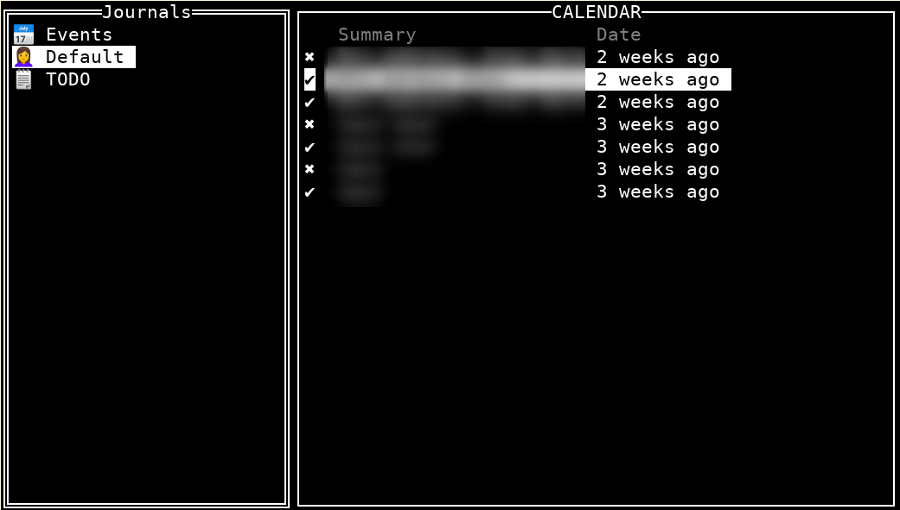

# go-etesync [](https://travis-ci.org/gchaincl/go-etesync)
Go implementation of Etesync protocol

[go-etesync](https://github.com/gchaincl/go-etesync) provides a [client library](https://godoc.org/github.com/gchaincl/go-etesync/api#HTTPClient) as well as a command line tool (etecli) to interact with a Etesync server.


# CLI Usage
```bash
NAME:
   etecli - ETESync cli tool

USAGE:
    [global options] command [command options] [arguments...]

COMMANDS:
     gui      Interactive gui
     help, h  Shows a list of commands or help for one command

   api:
     journals  Display available journals
     journal   Retrieve a journal given a uid
     entries   displays entries given a journal uid

GLOBAL OPTIONS:
   --url value       Server URL (default: "https://api.etesync.com") [$ETESYNC_URL]
   --email value     login email [$ETESYNC_EMAIL]
   --password value  login password [$ETESYNC_PASSWORD]
   --key value       encryption key [$ETESYNC_KEY]
   --db value        DB file path (default: "~/.etecli.db") [$ETESYNC_DB]
   --sync            force sync on start
   --help, -h        show help
   --version, -v     print the version
```
To query your journals check the `api:` command category.
You can easily navigate your journals using the _GUI_ tool provided by the `gui` sub-command

